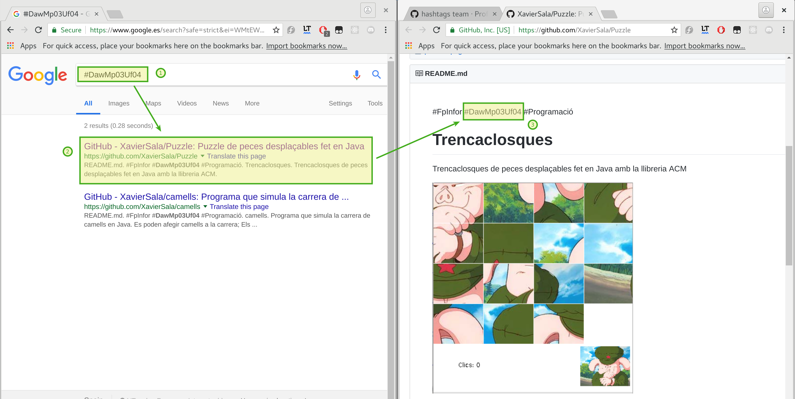
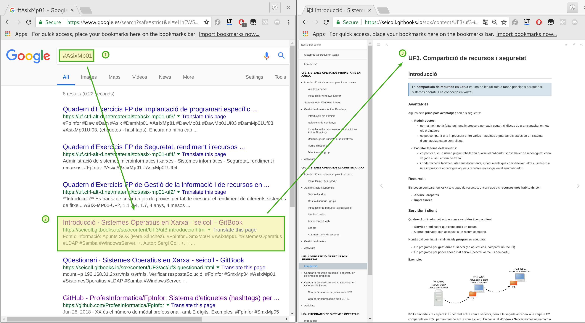
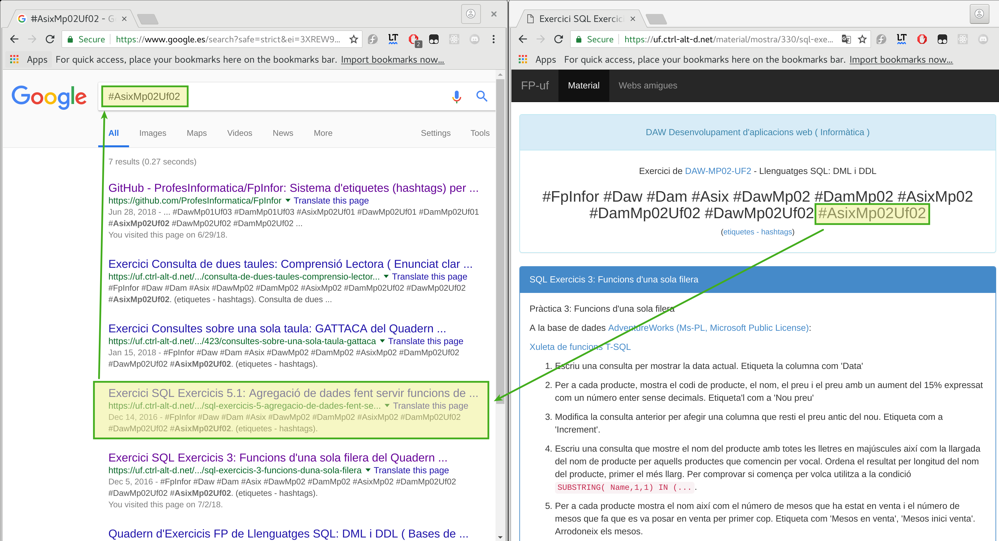

**Hashtag oficial per compartir material i experiències a FP d'Informàtica**

# `#FpInfor`

**Hashtags complementaris**

```
#Asix
#DamMp10
#SmxMp02Uf01
#Java
#BasesDeDades
#Gamificació
```

## Exemple

### Etiqueta `#DawMp03Uf04`



<br>

---

<br>

# Què són les etiquetes `#FpInfor`?

Són un sistema d’etiquetes *(hashtags)* per compartir material docent dels cicles formatius de la família d'Informàtica i Comunicacions.

Pots compartir el teu material afegint les etiquetes que el descriguin.

Per trobar material, indica l’etiqueta que t’interessi a un cercador d’Internet.

Si us plau, respecta la llicència dels material i esmenta l’autor original.


# Ús i nomenclatura

Les etiquetes estan organitzades de les més generals a les més concretes per facilitar les cerques.

## Etiqueta principal

`#FpInfor`

## Cicle
`#Cf`
> Cf son les sigles del cicle formatiu (Smx, Asix, Dam, Daw)

Exemple

```
#FpInfor #Smx
```

## Mòdul

`#CfMpXX`
> `XX` és el número de mòdul professional, amb **2 dígits**

Exemples:
```
#FpInfor #SmxMp05
#FpInfor #DamMp10
#FpInfor #DawMp08
#FpInfor #AsixMp01 #DamMp01 #DawMp01
```

## Unitat formativa

`#CfMpXXUfYY`
>  `YY` és el número d’unitat formativa, amb **2 dígits.**

Exemples:
```
#FpInfor #SmxMp05Uf03
#FpInfor #AsixMp10Uf01
```

## Àmbit
Podem etiquetar el material segons l’àmbit al que pertanyen

Exemples:
```
#FpInfor #Programació
#FpInfor #SistemesOperatius #SmxMp02Uf01
#FpInfor #BasesDeDades
#FpInfor #Maquinari
#FpInfor #Web
```

## Altres
També podem etiquetar el material segons la tecnologia, llenguatge, producte, metodologia didàctica, etc...

Exemples:
```
#FpInfor #Dam #Java
#FpInfor #WindowsServer #AsixMp01Uf02 #DawMp01Uf02 #DamMp01Uf02
#FpInfor #Gamificació
```

## Unitats formatives equivalents
Cal recordar que els tres cicles formatius de grau superior tenen algunes unitats formatives idèntiques entre els seus mòduls.

Aquestes són totes les equivalències:
```
#AsixMp01Uf01 #DawMp01Uf01 #DamMp01Uf01
#AsixMp01Uf02 #DawMp01Uf02 #DamMp01Uf02
#AsixMp01Uf03 #DawMp01Uf03 #DamMp01Uf03
#AsixMp02Uf01 #DawMp02Uf01 #DamMp02Uf01
#AsixMp02Uf02 #DawMp02Uf02 #DamMp02Uf02
#AsixMp02Uf03 #DawMp02Uf03 #DamMp02Uf03
#AsixMp03Uf01 #DawMp03Uf01 #DamMp03Uf01
#AsixMp03Uf02 #DawMp03Uf02 #DamMp03Uf02
#AsixMp03Uf03 #DawMp03Uf03 #DamMp03Uf03
#AsixMp04Uf01 #DawMp04Uf01 #DamMp04Uf01
#AsixMp04Uf02 #DawMp04Uf02 #DamMp04Uf02
#AsixMp04Uf03 #DawMp04Uf03 #DamMp04Uf03
```

Es recomana posar totes les equivalències.

## Més Exemples:

### Etiqueta `#AsixMp01`



### Etiqueta `#AsixMp02Uf02`


